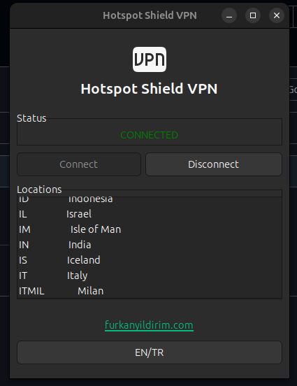
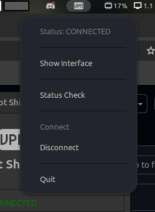

# Hotspot Shield VPN Application

This project is a desktop application developed using Python and GTK for the Hotspot Shield VPN client. The application allows you to manage your VPN connection, connect to different locations, and check your connection status. It also offers English and Turkish language support.

## Features

- **Connection Management:** Functions to connect to and disconnect from the VPN.
- **Location Selection:** List available VPN server locations and connect to a selected location.
- **Status Indicator:** System tray icon and status display showing the VPN connection status.
- **Language Support:** Ability to switch between English and Turkish.
- **User Session:** Log in to your Hotspot Shield account and check your session status.
- **Error Handling:** Provides notifications and error messages to the user in case of connection issues and errors.

## Requirements

- **Python 3.x**
- **Hotspot Shield CLI** (Ensure that the `hotspotshield` command-line tool is installed and configured on your system.)
- **PyGObject** (Python bindings for GTK and other GNOME libraries)

## Installation

1. **Clone the Repository:**

   ```bash
   git clone https://github.com/yourusername/hotspot-shield-app.git
   cd hotspot-shield-app
   ```

2. **Install Required Dependencies:**

   ```bash
   pip install -r requirements.txt
   ```

3. **Make the Script Executable:**

   ```bash
   chmod +x hotspot_shield_app.py
   ```

## Usage

You can start the application with the following command:

```bash
./hotspot_shield_app.py
```

When the program starts:

- It will attempt to connect to the VPN automatically.
- If you are not logged into your Hotspot Shield account, a login window will appear.
- You can check the connection status, connect to different locations, and switch between language options.

## Screenshots



*The application's main window and connection status.*

## Configuration

- **Language Switching:** You can change the language by clicking the "EN/TR" button located at the bottom right corner of the application.
- **VPN Locations:** Connect to a region by selecting your desired location from the list on the right side.
- **System Tray Icon:** The application runs in the system tray, allowing you to control the connection status from there as well.

## Contributing

1. **Fork** the project.
2. Create your feature branch (`git checkout -b feature/NewFeature`).
3. **Commit** your changes (`git commit -am 'Add new feature'`).
4. **Push** to the branch (`git push origin feature/NewFeature`).
5. Open a **Pull Request**.

## License

This project is licensed under the MIT License. See the `LICENSE` file for more details.

## Contact

For any questions or feedback, you can reach out via [furkanyildirim.com](https://furkanyildirim.com).

## Acknowledgments

- Thanks to the **PyGObject** and **GTK** community.
- Special thanks to the Hotspot Shield team.
- Gratitude to all developers contributing to the open-source world.

---

# Hotspot Shield VPN Uygulaması

Bu proje, Hotspot Shield VPN istemcisi için Python ve GTK kullanılarak geliştirilmiş bir masaüstü uygulamasıdır. Uygulama, VPN bağlantısını yönetmenize, farklı konumlara bağlanmanıza ve bağlantı durumunu kontrol etmenize olanak tanır. Ayrıca İngilizce ve Türkçe dil desteği sunar.

## Özellikler

- **Bağlantı Yönetimi:** VPN'e bağlanma ve bağlantıyı kesme işlevleri.
- **Konum Seçimi:** Mevcut VPN sunucu konumlarını listeleme ve seçilen konuma bağlanma.
- **Durum Göstergesi:** VPN bağlantı durumunu gösteren sistem tepsisi simgesi ve durum ekranı.
- **Dil Desteği:** İngilizce ve Türkçe arasında geçiş yapabilme.
- **Kullanıcı Oturumu:** Hotspot Shield hesabına giriş yapma ve oturum durumunu kontrol etme.
- **Hata Yönetimi:** Bağlantı sorunları ve hata durumları için kullanıcıya bildirim ve hata mesajları gösterir.

## Gereksinimler

- **Python 3.x**
- **Hotspot Shield CLI** (`hotspotshield` komut satırı aracının sisteminizde kurulu ve yapılandırılmış olması gerekmektedir.)
- **PyGObject** (GTK ve diğer GNOME kütüphaneleri için Python bağlayıcıları)

## Kurulum

1. **Depoyu Klonlayın:**

   ```bash
   git clone https://github.com/kullaniciadi/hotspot-shield-app.git
   cd hotspot-shield-app
   ```

2. **Gerekli Bağımlılıkları Yükleyin:**

   ```bash
   pip install -r requirements.txt
   ```

3. **Çalıştırma İzni Verin:**

   ```bash
   chmod +x hotspot_shield_app.py
   ```

## Kullanım

Uygulamayı aşağıdaki komutla başlatabilirsiniz:

```bash
./hotspot_shield_app.py
```

Program çalıştırıldığında:

- Otomatik olarak VPN'e bağlanmayı deneyecektir.
- Eğer Hotspot Shield hesabınıza giriş yapmadıysanız, giriş yapmanız için bir pencere açılacaktır.
- Bağlantı durumunu kontrol edebilir, farklı konumlara bağlanabilir ve dil seçenekleri arasında geçiş yapabilirsiniz.

## Ekran Görüntüleri


*Uygulamanın ana ekranı ve bağlantı durumu.*

## Yapılandırma

- **Dil Değiştirme:** Uygulamanın sağ alt kısmındaki "EN/TR" butonunu kullanarak dil değiştirebilirsiniz.
- **VPN Konumları:** Sağ taraftaki listeden istediğiniz konumu seçerek o bölgeye bağlanabilirsiniz.
- **Sistem Tepsisi İkonu:** Uygulama sistem tepsisinde çalışır ve bağlantı durumunu buradan da kontrol edebilirsiniz.

## Katkıda Bulunma

1. **Fork** edin.
2. Kendi dalınızı oluşturun (`git checkout -b feature/YeniOzellik`).
3. Yaptığınız değişiklikleri **commit** edin (`git commit -am 'Yeni özelliği ekledim'`).
4. Dalınıza **push** edin (`git push origin feature/YeniOzellik`).
5. Bir **Pull Request** oluşturun.

## Lisans

Bu proje MIT Lisansı ile lisanslanmıştır. Daha fazla bilgi için `LICENSE` dosyasına bakınız.

## İletişim

Herhangi bir sorunuz veya geri bildiriminiz için [furkanyildirim.com](https://furkanyildirim.com) adresinden ulaşabilirsiniz.

## Teşekkür

- **PyGObject** ve **GTK** topluluğuna teşekkürler.
- Hotspot Shield ekibine özel teşekkürler.
- Açık kaynak dünyasına katkıda bulunan tüm geliştiricilere minnettarız.

---

**Note:** Ensure that your internet connection and Hotspot Shield account are active for the application to work properly.

**Not:** Uygulamanın düzgün çalışması için internet bağlantınızın ve Hotspot Shield hesabınızın aktif olduğundan emin olunuz.
